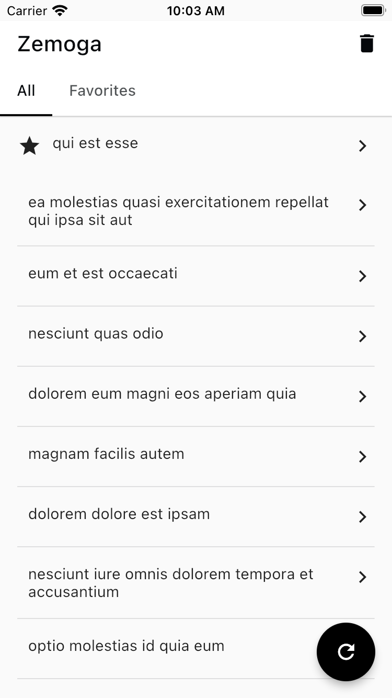
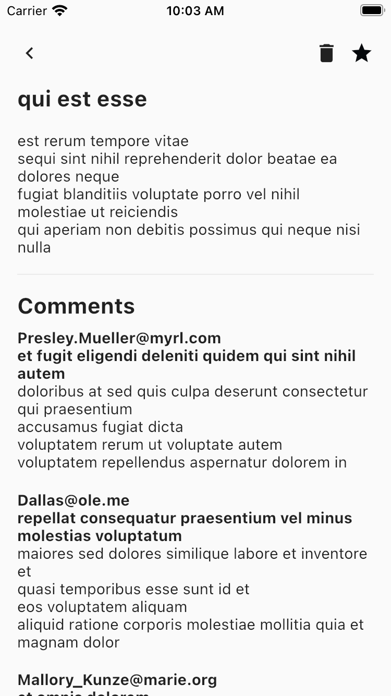
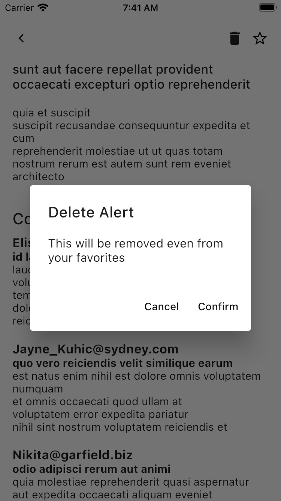

# Zemoga Posts

![coverage][coverage_badge]
[![style: very good analysis][very_good_analysis_badge]][very_good_analysis_link]
[![License: MIT][license_badge]][license_link]

Generated by the [Very Good CLI][very_good_cli_link] 🤖

A simple posts app.

---

## Features

- [x] The user can view/delete posts from service [json_url].
- [x] The user can add posts to favorite.

## Dependencies

- **[Flutter Bloc][flutter_bloc_link]** : State management & built in testing support.
- **[Dio][dio_link]** : Handling network calls.
- **[Easy Loading][easy_loading_link]** : Handling loading states.
- **[Hive Flutter][hive_link]** : Handling caching of the posts. 
- **[Freezed][freezed_link]** & **[Json Serializable][json_serializable_link]**: Data classes and Json serialization.
- **[Mocktail][mocktail_link]** : For mocking dependencies for testing purposes.
- **[Very Good Cli][very_good_cli_link]** : Quickly bootstrapping projects with standard practices.

## Architecture & Processes

- Layered architecture with a good separation of concerns between the presentation layer, business logic, repositories & the network layer.
- Tested code. (Widget, Unit Tests. Need to add some Integration Tests)
- In par with the [Test Pyramid][test_pyramid_link]

## Explanation of the Solution

- Created two different packages - posts_repository and posts_api_client. Only posts_api_client can make the network calls with the help of Dio and can cache the posts using Hive. Posts repository interacts with the posts_api_client for functionalities. This way code is more independent and reusable.
- Hive greatly outperforms SQLite and SharedPreferences when it comes to writing or deleting which is why Hive has been used to handle caching.
- Cubit has been used for state management. It interacts with the posts_repository and updates the state by which widget renders according to it. Cubit is a simple state management that abandons the concept of events from BloC to make emitting states easier. In the case of app, BloC is not needed in my opinion.

## Alternatives

- Using separate cubit to handle favorites with bloc to bloc communication acting as means to handle posts and favorite. This can implemented later with more time.
- Could have used same hive box to store favorites by adding isFavorite parameter to the Post model. 
- In this project, there is a separate hive box to store the favorite posts which has kept everything well separated and easy for modification. Only con is that, there is an extra hive box created for this.

## Improvements (if supported by the project timeline)

- [ ] More fined grained exception handling.
- [ ] Whiteboard different approaches for caching.
- [ ] Fix redundant and incomplete documentations.
- [ ] Refactor the tests to follow the robot testing pattern for better readability and maintenance.
- [ ] Add integration and E2E tests.
- [ ] Add proper internationalization using the l10n library.


## Getting Started 🚀

This project contains 3 flavors:

- development
- staging
- production

To run the desired flavor either use the launch configuration in VSCode/Android Studio or use the following commands:

```sh
# Development
$ flutter run --flavor development --target lib/main_development.dart

# Staging
$ flutter run --flavor staging --target lib/main_staging.dart

# Production
$ flutter run --flavor production --target lib/main_production.dart
```

_\*Zemoga Posts works on iOS, Android, Web, and Windows._

---

## Running Tests 🧪

To run all unit and widget tests use the following command:

```sh
$ sh test.sh
```

To view the generated coverage report you can use [lcov](https://github.com/linux-test-project/lcov).

```sh
# Generate Coverage Report
$ genhtml coverage/lcov.info -o coverage/

# Open Coverage Report
$ open coverage/index.html
```

---

## Working with Translations 🌐

This project relies on [flutter_localizations][flutter_localizations_link] and follows the [official internationalization guide for Flutter][internationalization_link].

### Adding Strings

1. To add a new localizable string, open the `app_en.arb` file at `lib/l10n/arb/app_en.arb`.

```arb
{
    "@@locale": "en",
    "counterAppBarTitle": "Counter",
    "@counterAppBarTitle": {
        "description": "Text shown in the AppBar of the Counter Page"
    }
}
```

2. Then add a new key/value and description

```arb
{
    "@@locale": "en",
    "counterAppBarTitle": "Counter",
    "@counterAppBarTitle": {
        "description": "Text shown in the AppBar of the Counter Page"
    },
    "helloWorld": "Hello World",
    "@helloWorld": {
        "description": "Hello World Text"
    }
}
```

3. Use the new string

```dart
import 'package:zemoga_posts/l10n/l10n.dart';

@override
Widget build(BuildContext context) {
  final l10n = context.l10n;
  return Text(l10n.helloWorld);
}
```

### Adding Supported Locales

Update the `CFBundleLocalizations` array in the `Info.plist` at `ios/Runner/Info.plist` to include the new locale.

```xml
    ...

    <key>CFBundleLocalizations</key>
	<array>
		<string>en</string>
		<string>es</string>
	</array>

    ...
```

### Adding Translations

1. For each supported locale, add a new ARB file in `lib/l10n/arb`.

```
├── l10n
│   ├── arb
│   │   ├── app_en.arb
│   │   └── app_es.arb
```

2. Add the translated strings to each `.arb` file:

`app_en.arb`

```arb
{
    "@@locale": "en",
    "counterAppBarTitle": "Counter",
    "@counterAppBarTitle": {
        "description": "Text shown in the AppBar of the Counter Page"
    }
}
```

`app_es.arb`

```arb
{
    "@@locale": "es",
    "counterAppBarTitle": "Contador",
    "@counterAppBarTitle": {
        "description": "Texto mostrado en la AppBar de la página del contador"
    }
}
```

### App Screenshots

 
 
 

[coverage_badge]: coverage_badge.svg
[flutter_localizations_link]: https://api.flutter.dev/flutter/flutter_localizations/flutter_localizations-library.html
[internationalization_link]: https://flutter.dev/docs/development/accessibility-and-localization/internationalization
[license_badge]: https://img.shields.io/badge/license-MIT-blue.svg
[license_link]: https://opensource.org/licenses/MIT
[very_good_analysis_badge]: https://img.shields.io/badge/style-very_good_analysis-B22C89.svg
[very_good_analysis_link]: https://pub.dev/packages/very_good_analysis
[very_good_cli_link]: https://github.com/VeryGoodOpenSource/very_good_cli
[test_pyramid_link]: https://martinfowler.com/articles/practical-test-pyramid.html
[json_url]: https://jsonplaceholder.typicode.com/
[flutter_bloc_link]: https://pub.dev/publishers/bloclibrary.dev/packages
[json_serializable_link]: https://pub.dev/packages/json_serializable
[dio_link]: https://pub.dev/packages/dio
[mocktail_link]: https://pub.dev/packages/mocktail
[freezed_link]: https://pub.dev/packages/freezed
[easy_loading_link]: https://pub.dev/packages/flutter_easyloading
[hive_link]: https://pub.dev/packages/hive_flutter

